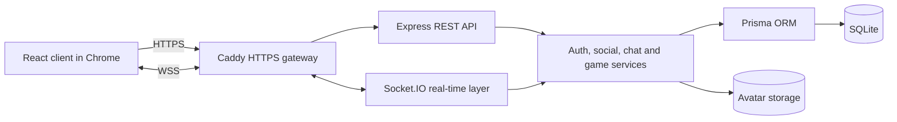
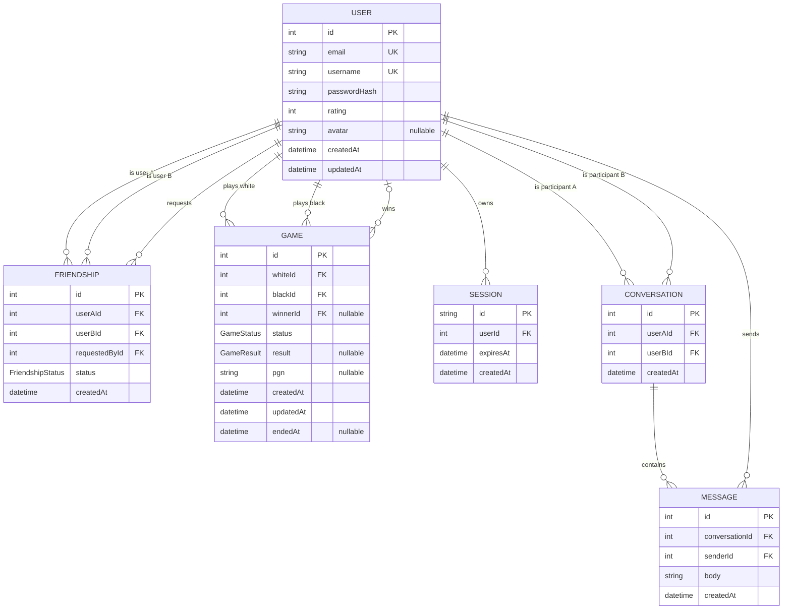

*This project has been created as part of the 42 curriculum by tbolsako, tndreka, snazarov, aokhapki.*

# ChessMate

## Description

ChessMate is a real-time multiplayer chess platform. Its goal is to provide a complete browser-based chess experience in which registered users can find an opponent, play an authoritative live match from separate computers, communicate, and maintain a persistent social and game profile.

Key features include:

- secure email/password registration and session-based login;
- live two-player chess with server-side rule validation;
- matchmaking, reconnection, resignation, checkmate, and draw handling;
- profiles, avatar uploads, user search, friend requests, and online presence;
- persistent one-to-one chat;
- match history, player statistics, points, and a leaderboard;
- responsive light and dark interfaces built from a custom design system;
- containerized development and HTTPS deployment environments.

## Instructions

### Prerequisites

- [Git](https://git-scm.com/)
- [Docker Engine](https://docs.docker.com/engine/) with the Docker Compose plugin
- the latest stable version of Google Chrome

No host installation of Node.js, npm, SQLite, or Caddy is required.

### Configuration

Clone the repository and create the local backend environment file:

```bash
git clone https://github.com/mypmypmew/transcendence_chess42.git
cd transcendence_chess42
cp backend/.env.example backend/.env
```

The development database defaults to `backend/prisma/dev.db`. Environment files and SQLite database files are excluded from Git. Never commit real credentials or session data.

### HTTPS deployment (recommended for evaluation)

Build and start the application with one command:

```bash
docker compose -f docker-compose.prod.yml up -d --build
```

Open <https://localhost> in Google Chrome. The health endpoint is available at <https://localhost/api/health>.

Caddy terminates HTTPS and reverse-proxies API, upload, and Socket.IO traffic to the backend. On a local machine, Caddy uses its local certificate authority, so the generated root certificate may need to be trusted by the operating system or browser before Chrome accepts it without a certificate warning.

View service status and logs:

```bash
docker compose -f docker-compose.prod.yml ps
docker compose -f docker-compose.prod.yml logs -f
```

Stop the deployment without deleting persistent data:

```bash
docker compose -f docker-compose.prod.yml down
```

### Development environment

For Vite hot reload and direct access to both services:

```bash
docker compose up -d --build
```

Open <http://localhost:5173>. The backend health endpoint is <http://localhost:3000/api/health>. This mode is intended for local development; use the Caddy deployment above when demonstrating the mandatory HTTPS requirement.

Stop it with:

```bash
docker compose down
```

### Tests and static checks

With the development containers available, run:

```bash
docker compose run --rm backend npm test
docker compose run --rm frontend npm run lint
docker compose run --rm frontend npm run build
docker compose run --rm frontend sh -lc 'node --test test/*.test.js'
```

The backend applies committed Prisma migrations automatically when it starts.

## How to Use ChessMate

1. Register two accounts in separate browser profiles or on separate computers.
2. Open **Play** with both accounts and join the matchmaking queue.
3. After a match is created, make moves from each player's board. The server validates moves and broadcasts the authoritative position.
4. Refresh or briefly disconnect a player to demonstrate restoration of the active game.
5. Finish by checkmate, draw, or resignation and verify the result in history and the leaderboard.
6. Use **Friends** to search for the other account and accept a friend request.
7. Check live presence and exchange messages in **Chat**.
8. Edit the profile and upload a PNG, JPEG, or WebP avatar of at most 2 MB.

## Architecture



### Additional Diagrams

- [Business process flow](docs/ChessMate_Business_Process.png)
- [High-level system architecture](docs/ChessMate_HighLevel_System_Architecture.png)
- [Friends and chat sequence diagrams](docs/sequence-diagram.md)

The server owns the matchmaking queue and active chess state. Clients submit actions, while `chess.js` on the backend validates moves and produces the state broadcast to both players. Completed games, PGN, points, users, friendships, sessions, conversations, and messages are persisted through Prisma.

## Technical Stack

| Layer | Technologies | Why this choice was made |
| --- | --- | --- |
| Frontend | React 19, React Router 7, Vite 8 | React provides reusable stateful components, React Router handles protected client routes, and Vite gives a small and fast development/build setup. |
| UI and chessboard | Custom CSS design tokens and React components, Tabler icons, `react-chessboard` | The custom system keeps both themes and all screens visually consistent while a dedicated board component avoids reimplementing board rendering. |
| Backend | Node.js, Express 5 | Express supplies a clear route/middleware structure while remaining lightweight enough for the project's services and repositories. |
| Real time | Socket.IO 4 | Socket rooms, acknowledgements, reconnect events, and connection lifecycle handling fit live games, chat, matchmaking, and presence. |
| Chess rules | `chess.js` | A tested chess rules engine provides legal move, checkmate, draw, FEN, and PGN handling; the backend remains authoritative. |
| Database | SQLite | The data is relational and the expected school-project deployment fits a simple embedded database with no separate database server. |
| Data access | Prisma 6 | The schema, generated client, migrations, relations, and transactions make database access explicit and consistent. |
| Deployment | Docker Compose, Caddy 2 | Compose starts the full stack reproducibly with one command; Caddy serves the built SPA and provides HTTPS plus reverse proxying. |
| Testing | Node.js test runner | Backend services, repositories, sockets, concurrency paths, and frontend statistics logic are covered without an additional test framework. |

## Database Schema



Important constraints and relations:

- `User.email` and `User.username` are unique; passwords are stored only as bcrypt hashes.
- A friendship stores a canonical user pair and is unique on `(userAId, userBId)`.
- A conversation is unique for its canonical pair of participants.
- A game references both players and, when applicable, its winner. Its PGN stores the completed move history.
- Sessions belong to one user and expire after seven days.
- Deleting users cascades through sessions, friendships, conversations, and messages; game participants are retained to preserve match history.

The source of truth is [`backend/prisma/schema.prisma`](backend/prisma/schema.prisma); migration history is stored in [`backend/prisma/migrations`](backend/prisma/migrations).

## Features

| Feature | Functionality | Primary contributor(s) |
| --- | --- | --- |
| Registration and login | Validates credentials, hashes passwords with bcrypt, creates database-backed sessions, and protects private routes. | tndreka (backend/auth), aokhapki (frontend), snazarov (integration and fixes) |
| Profile management | Updates username/email and displays a dedicated account profile. | tndreka (backend), aokhapki (frontend) |
| Avatar management | Validates PNG/JPEG/WebP type and 2 MB size on the server, stores the image, and replaces the previous avatar. | tndreka (backend and storage), aokhapki (frontend) |
| User discovery and profiles | Searches users and exposes safe public profile, rating, and match information. | snazarov (backend search), aokhapki (frontend), tbolsako (player history) |
| Friends | Sends, accepts, rejects/cancels requests; lists and removes accepted friends. | snazarov (backend), aokhapki (frontend), tndreka (presence integration) |
| Online presence | Tracks multiple sockets per account and broadcasts status changes to accepted friends. | tndreka |
| Chat | Opens one-to-one conversations, persists message history, and delivers new messages in real time. | tndreka (full-stack implementation), aokhapki (initial UI and shared components) |
| Matchmaking | Maintains a live queue, pairs two available users, and prevents duplicate/overlapping games. | tbolsako |
| Multiplayer chess | Validates moves on the server, synchronizes both boards, and handles checkmate, draws, and resignation. | tbolsako (primary implementation), aokhapki (board UI), snazarov (early game-service foundation) |
| Game recovery | Restores an active game after route changes or reconnects and safely cancels orphaned in-progress games after a server restart. | tbolsako (backend and tests), snazarov (frontend recovery fixes) |
| History and statistics | Stores PGN/results and displays recent games, totals, win rate, weekly activity, and public player history. | tbolsako (primary implementation), tndreka (initial history endpoints), aokhapki (frontend presentation) |
| Points and leaderboard | Atomically awards points once per completed game and ranks users from persisted results. | tbolsako |
| Custom interface system | Supplies shared controls, panels, tables, messages, typography, icons, color tokens, and light/dark themes. | aokhapki |
| Responsive and accessible UI | Adapts navigation and page grids to smaller screens and uses semantic labels, keyboard actions, focus management, and readable status text. | aokhapki (primary implementation), tbolsako (testing and fixes) |
| Input validation and error handling | Validates authentication, profile, chat, game, friendship, and upload input on the relevant frontend and backend boundaries. | tndreka, aokhapki, snazarov, tbolsako |
| Legal pages | Provides accessible Privacy Policy and Terms of Service links and project-relevant content. | aokhapki |
| Containerized HTTPS deployment | Builds the SPA, starts the backend and database migration flow, persists data/uploads, and serves everything through Caddy. | snazarov (deployment), tndreka (upload proxy and persistence) |

## Modules

ChessMate claims exactly **14 module points**. Major modules are worth 2 points and minor modules are worth 1 point.

| Category | Chosen module | Type | Points | Implementation and justification | Contributor(s) |
| --- | --- | ---: | ---: | --- | --- |
| Web | Use a framework for both frontend and backend | Major | 2 | React structures the client and Express structures backend routes, middleware, services, and repositories. Both are used throughout the application rather than as superficial wrappers. | snazarov, aokhapki, tndreka, tbolsako |
| Web | Real-time features using WebSockets | Major | 2 | Socket.IO powers authenticated matchmaking, game rooms, synchronized moves, chat, presence, disconnect handling, and reconnect flows. Real-time communication is central to the product. | tbolsako (game and matchmaking), tndreka (chat and presence), snazarov (socket foundation and integration) |
| Web | Allow users to interact with other users | Major | 2 | Users have public profiles, a full request/accept/remove friend flow, friends lists, and persistent one-to-one chat. | tndreka (chat and presence), snazarov (friendship backend and search), aokhapki (frontend) |
| Web | Use an ORM for the database | Minor | 1 | All application persistence uses Prisma models, repositories, migrations, relations, and transactions over SQLite. | snazarov (initial schema and repositories), tndreka (auth/chat/profile data), tbolsako (game/points transactions) |
| Web | Custom-made design system | Minor | 1 | The frontend defines shared color and typography tokens, a common Tabler icon wrapper, and 21 reusable React UI components used across the application. | aokhapki |
| User Management | Standard user management and authentication | Major | 2 | Users can register/login, edit their profile, upload/default an avatar, add friends, see live friend status, and view profile information. | tndreka (auth/profile/presence), snazarov (friendship and search backend), aokhapki (frontend) |
| Gaming and user experience | Complete web-based game | Major | 2 | ChessMate implements playable live chess with clear legal moves, turns, resignation, checkmate and draw outcomes, persisted results, and an in-app rules guide. | tbolsako (primary implementation), aokhapki (board UI), snazarov (early game-service foundation) |
| Gaming and user experience | Remote players | Major | 2 | Two authenticated players on separate clients share an authoritative live match. Rooms isolate games, state is synchronized, and active games can be restored after a disconnect. | tbolsako (primary implementation), snazarov (socket lifecycle and integration) |
|  | **Total** |  | **14** |  |  |

No points are claimed for unfinished or partial features such as 2FA, OAuth, achievements, advanced chat, extra-browser support, tournaments, AI, analytics, or DevOps modules.

## Team Information

The role labels below formalize the responsibilities that each member took on during development. Every member also worked as a developer, while the product, coordination, architecture, and feature-ownership responsibilities were distributed across the team.

| Team member / 42 login | Assigned role(s) | Responsibilities |
| --- | --- | --- |
| `snazarov` | Product Owner, Technical Lead / Architect, Full-stack Developer | Defined the product direction and priorities, maintained the backlog, made cross-cutting architecture decisions, coordinated technical integration, validated completed work, and implemented the core backend, infrastructure, and full-stack fixes. |
| `aokhapki` | Project Manager / Scrum Master, Frontend / UI Developer | Organized and facilitated team calls in Google Meet, helped track progress and blockers, coordinated follow-up work, and owned the main frontend experience, responsive layouts, and custom design system. |
| `tndreka` | Full-stack Developer, Authentication and Chat owner | Owned authentication/session work and the full chat flow; also implemented profile/avatar backend functionality, online presence, validation, and related tests. |
| `tbolsako` | Game and Real-time Developer, Testing / QA owner | Owned the main multiplayer chess implementation, matchmaking, synchronization, recovery, game completion and points work; also tested the frontend and fixed integration and UI defects. |

## Project Management

- `snazarov`, acting as Product Owner, maintained the product direction, translated missing requirements into GitHub Issues, set priorities, and validated integrated work. As Technical Lead, he also coordinated architecture and cross-feature integration.
- Work was organized around feature ownership: `aokhapki` focused on the frontend, `tndreka` on authentication/chat and related user features, `tbolsako` on the game and real-time gameplay, while `snazarov` handled architecture, backend work, deployment, integration, and uncovered gaps.
- `aokhapki`, acting as Project Manager / Scrum Master, organized and facilitated team synchronization calls in Google Meet. The calls were used to review progress, distribute upcoming work, and identify blockers and integration problems.
- GitHub Issues and pull-request discussions provided the asynchronous record of tasks and technical decisions.
- Changes were developed on issue/feature branches and integrated through pull requests. Cross-area fixes were assigned as they appeared during integration and testing.
- The repository history records substantial contributions from all four team members.

## Individual Contributions

### `snazarov`

- Owned product scope, backlog priorities, technical architecture, acceptance of integrated work, and final integration across the project.
- Established the initial React/Express/Docker structure, Prisma/SQLite schema and repositories, and the Socket.IO foundation.
- Implemented the friendship and user-search backend, game-history foundations, Docker/Caddy HTTPS deployment, same-origin API/socket routing, and numerous frontend/backend integration fixes.
- Reviewed uncovered gaps across all areas and implemented missing behavior rather than limiting work to one subsystem.
- A major challenge was integrating independently developed real-time and persistent features without duplicate operations or conflicting state. This was addressed with authoritative backend services, database constraints/transactions, player-availability guards, and targeted regression tests.

### `aokhapki`

- Owned most of the frontend: authentication screens, dashboard, navigation, profiles, friends, chat presentation, leaderboard, legal pages, game presentation, and API integration.
- Designed and implemented the reusable component system, color and typography tokens, Tabler icon wrapper, light/dark themes, responsive layouts, shared modals, rows, panels, inputs, and feedback states.
- Implemented frontend profile editing and avatar flows, friend/chat actions, public profile views, and responsive mobile fixes.
- Acting as Project Manager / Scrum Master, organized and facilitated the team's Google Meet calls, reviewed progress and blockers with the team, and coordinated follow-up work.
- A major challenge was converting a large mocked interface into a consistent API-backed application while features were changing in parallel. Shared primitives, reusable hooks, centralized API helpers, and incremental replacement of mock data kept the UI maintainable.

### `tndreka`

- Implemented secure registration, login, logout, sessions, authentication middleware, input validation, bcrypt password storage, and authenticated Socket.IO handshakes.
- Owned the full persistent chat implementation: database models, repositories, services, REST endpoints, socket rooms, message delivery, history loading, reconnect behavior, user search, and frontend state handling.
- Implemented online presence, profile update and avatar-upload backend flows, storage/proxy integration, and their automated tests.
- A major chat challenge was preventing lost or duplicated messages when history requests, room joins, reconnects, and live events overlapped. The solution combined authenticated room membership, join acknowledgements, canonical conversations, message merging by ID, and reconnect re-synchronization.

### `tbolsako`

- Implemented the main authoritative multiplayer chess flow, matchmaking queue, game socket rooms, move validation, resignation, game completion, reconnect and active-game recovery.
- Added persistence of results and PGN, atomic points updates, points recalculation, public player history, statistics, leaderboard integration, and extensive game/concurrency tests.
- Tested the frontend and contributed responsive, navigation, game-guide, history, leaderboard, and general integration fixes.
- A major challenge was keeping both players synchronized while ensuring a final move or resignation was persisted exactly once. Pending-state guards, transactional completion, server-authoritative broadcasts, reconnection restoration, and concurrency tests were used to make the flow reliable.

## Known Limitations

- Active chess state and the matchmaking queue are held in backend memory. After a backend restart, unfinished games are marked as cancelled; completed history, ratings, accounts, chat, and friendships remain persistent.
- The HTTPS deployment uses Caddy's local certificate authority by default. A public deployment should configure a real domain and publicly trusted certificate.
- Google Chrome is the tested and guaranteed browser; no additional-browser module is claimed.

## Resources

### Documentation and references

- [React documentation](https://react.dev/)
- [React Router documentation](https://reactrouter.com/)
- [Vite documentation](https://vite.dev/)
- [Express documentation](https://expressjs.com/)
- [Socket.IO documentation](https://socket.io/docs/v4/)
- [Prisma documentation](https://www.prisma.io/docs)
- [SQLite documentation](https://www.sqlite.org/docs.html)
- [`chess.js` documentation](https://jhlywa.github.io/chess.js/)
- [Docker Compose documentation](https://docs.docker.com/compose/)
- [Caddy documentation](https://caddyserver.com/docs/)
- [MDN Web Docs](https://developer.mozilla.org/)

### Use of AI

AI-assisted tools were used as a development aid for:

- breaking requirements into implementation and verification tasks;
- reviewing and debugging backend concurrency, real-time game, reconnect, and persistence behavior;
- proposing test cases and helping interpret failing tests;
- reviewing mandatory/module coverage against the subject;
- drafting and checking technical documentation, including this README.

AI output was treated as a suggestion, not as an authority: team members reviewed the proposed code and documentation, ran the tests, manually exercised multi-user flows, and remained responsible for every submitted change.
