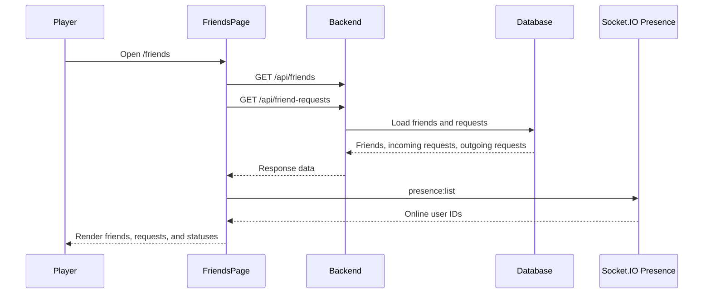
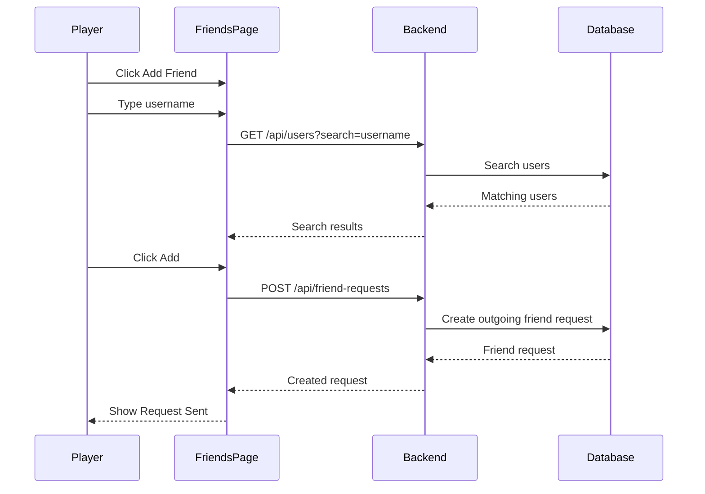
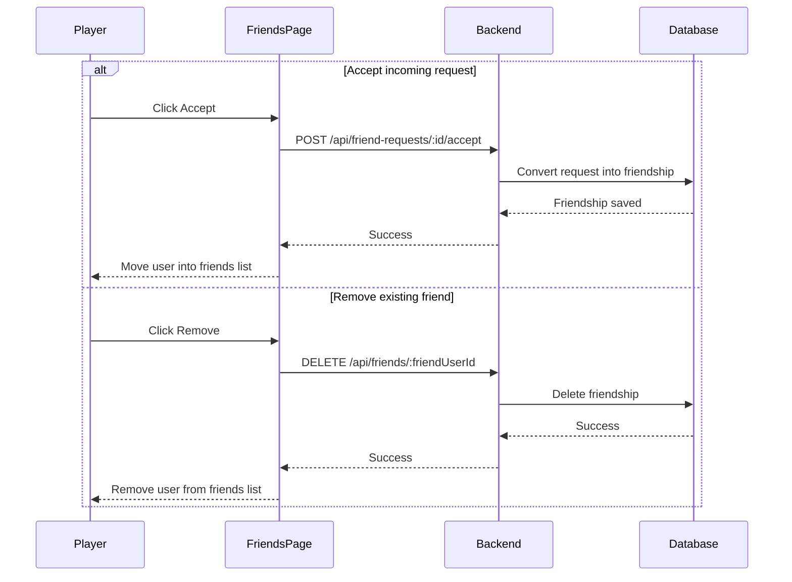
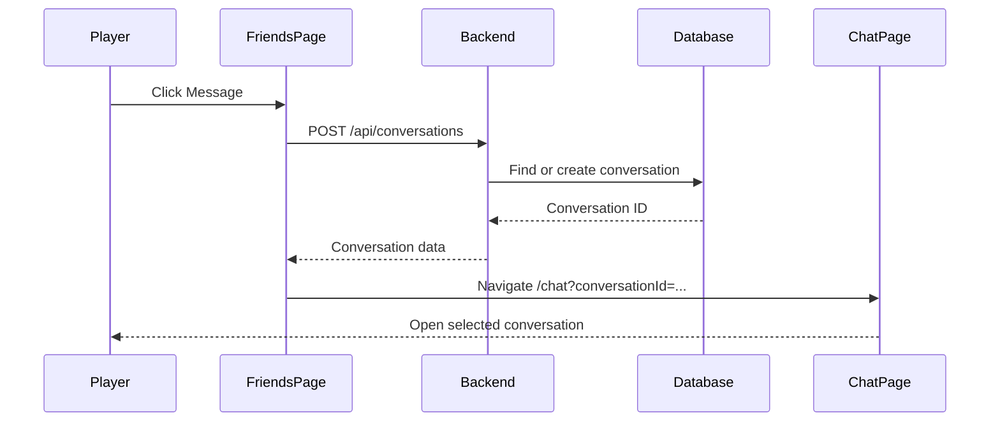

# Sequence Diagrams
### Friends Page Load Flow

```mermaid
sequenceDiagram
  participant Player
  participant FriendsPage
  participant Backend
  participant Database
  participant Presence as Socket.IO Presence

  Player->>FriendsPage: Open /friends
  FriendsPage->>Backend: GET /api/friends
  FriendsPage->>Backend: GET /api/friend-requests
  Backend->>Database: Load friends and requests
  Database-->>Backend: Friends, incoming requests, outgoing requests
  Backend-->>FriendsPage: Response data
  FriendsPage->>Presence: presence:list
  Presence-->>FriendsPage: Online user IDs
  FriendsPage-->>Player: Render friends, requests, and statuses
```

### Add Friend Flow

```mermaid
sequenceDiagram
  participant Player
  participant FriendsPage
  participant Backend
  participant Database

  Player->>FriendsPage: Click Add Friend
  Player->>FriendsPage: Type username
  FriendsPage->>Backend: GET /api/users?search=username
  Backend->>Database: Search users
  Database-->>Backend: Matching users
  Backend-->>FriendsPage: Search results
  Player->>FriendsPage: Click Add
  FriendsPage->>Backend: POST /api/friend-requests
  Backend->>Database: Create outgoing friend request
  Database-->>Backend: Friend request
  Backend-->>FriendsPage: Created request
  FriendsPage-->>Player: Show Request Sent
```

### Accept Or Remove Friend Flow

```mermaid
sequenceDiagram
  participant Player
  participant FriendsPage
  participant Backend
  participant Database

  alt Accept incoming request
    Player->>FriendsPage: Click Accept
    FriendsPage->>Backend: POST /api/friend-requests/:id/accept
    Backend->>Database: Convert request into friendship
    Database-->>Backend: Friendship saved
    Backend-->>FriendsPage: Success
    FriendsPage-->>Player: Move user into friends list
  else Remove existing friend
    Player->>FriendsPage: Click Remove
    FriendsPage->>Backend: DELETE /api/friends/:friendUserId
    Backend->>Database: Delete friendship
    Database-->>Backend: Success
    Backend-->>FriendsPage: Success
    FriendsPage-->>Player: Remove user from friends list
  end
```

### Friends To Chat Flow

```mermaid
sequenceDiagram
  participant Player
  participant FriendsPage
  participant Backend
  participant Database
  participant ChatPage

  Player->>FriendsPage: Click Message
  FriendsPage->>Backend: POST /api/conversations
  Backend->>Database: Find or create conversation
  Database-->>Backend: Conversation ID
  Backend-->>FriendsPage: Conversation data
  FriendsPage->>ChatPage: Navigate /chat?conversationId=...
  ChatPage-->>Player: Open selected conversation
```